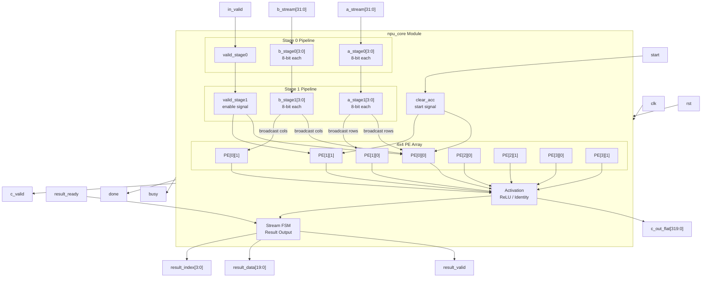
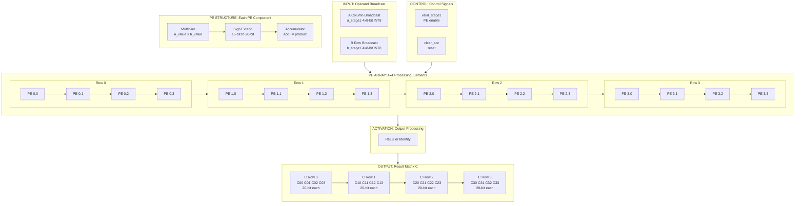
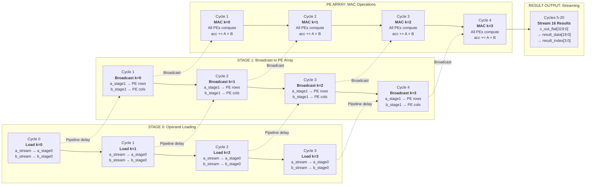

# Pipelined INT8 NPU Core

A 4×4 INT8 neural processing unit focused on matrix multiply-accumulate throughput. The design uses a two-stage outer-product pipeline with configurable parameters for array size, data width, and activation functions.

---

## Architecture

### Top-Level Block Diagram



The system includes a dual-stage operand pipeline that broadcasts matrix A columns and matrix B rows to a 4×4 processing element array. Each PE performs multiply-accumulate operations. Results can be read through either a packed output bus or a streaming interface with ready/valid handshaking.

### PE Array Detail



The outer-product algorithm computes C = A × B by streaming columns of A and rows of B. For each column k, the PE at position [i][j] computes `PE[i][j] += A[i][k] × B[k][j]`. Accumulation happens over multiple cycles as k increments from 0 to ARRAY_SIZE-1.

### Pipeline



The two-stage pipeline keeps the PE array busy by overlapping operand loading and computation. Stage 0 receives inputs while stage 1 feeds the array, reducing latency and enabling continuous streaming.

---

## Quantization

The NPU processes INT8 data, but most neural networks train in floating-point. Quantization happens in software before feeding data to the hardware.

The implementation uses symmetric quantization with zero-point = 0:
- Scale factor: `scale = max(|min|, |max|) / 127`
- Quantize: `q = clamp(round(x / scale), -128, 127)`
- Dequantize: `x ≈ q × scale`

The flow is: FP32 data → quantize in software → send INT8 to hardware → hardware computes → optionally dequantize output.

---

## Repository Structure

```
Quantized-Stream-NPU/
├── rtl/
│   ├── npu_core.sv           # Top-level NPU module
│   └── pe.sv                 # Processing element (MAC unit)
├── tb/
│   └── npu_integrated_tb.sv  # Testbench
├── sw/
│   ├── gen_test_vectors.cpp  # Generates quantized test vectors
│   └── host_demo.cpp         # Reference model (optional)
└── build/                    # Build artifacts
```

---

## Quick Start

### Prerequisites

- Icarus Verilog: `choco install icarus-verilog` (Windows)
- C++ compiler with C++17 support

Verify:
```powershell
iverilog -V
g++ --version
```

### Running the Test

This runs the full integration: quantize FP32 matrices, feed INT8 to RTL, verify output.

```powershell
cd "Quantized-Stream-NPU"; g++ -std=c++17 -O2 -o build/gen_test_vectors.exe sw/gen_test_vectors.cpp; .\build\gen_test_vectors.exe; iverilog -g2012 -o build/npu_integrated_tb rtl/pe.sv rtl/npu_core.sv tb/npu_integrated_tb.sv; vvp build/npu_integrated_tb
```

Expected output:
```
Quantization Parameters:
  Matrix A: scale=0.0354331, zero_point=0
  Matrix B: scale=0.0433071, zero_point=0

[...matrices displayed...]

[TB] Loaded test vectors from build/test_vectors.hex
[TB] Streaming quantized INT8 data to RTL...
[PASS] All 16 outputs match golden reference

Integration Test PASSED
```

Use `--random` for random test data:
```powershell
cd "Quantized-Stream-NPU"; g++ -std=c++17 -O2 -o build/gen_test_vectors.exe sw/gen_test_vectors.cpp; .\build\gen_test_vectors.exe --random; iverilog -g2012 -o build/npu_integrated_tb rtl/pe.sv rtl/npu_core.sv tb/npu_integrated_tb.sv; vvp build/npu_integrated_tb
```

---

## Interface

### Input Side

```systemverilog
input                               start,        // Pulse to begin computation
input                               in_valid,     // Valid signal for operands
input  [ARRAY_SIZE*DATA_WIDTH-1:0] a_stream,    // Column of matrix A
input  [ARRAY_SIZE*DATA_WIDTH-1:0] b_stream,    // Row of matrix B
```

Feed operands column-by-column. For column k, present A[:,k] on `a_stream` and B[k,:] on `b_stream` with `in_valid` high. Repeat for ARRAY_SIZE cycles.

### Output Side

Two output modes:

**Packed output:**
```systemverilog
output                              done,         // Computation complete
output                              c_valid,      // Output valid
output [OUTPUT_COUNT*ACC_WIDTH-1:0] c_out_flat, // All results at once
```

**Streaming output:**
```systemverilog
output                              result_valid, // Data available
output [ACC_WIDTH-1:0]              result_data,  // One element per cycle
output [INDEX_WIDTH-1:0]            result_index, // Current index (0 to 15)
input                               result_ready  // Consumer ready
```

Streaming follows row-major order: index 0 = C[0,0], index 1 = C[0,1], ..., index 15 = C[3,3].

---

## Parameters

Configure at instantiation:

```systemverilog
npu_core #(
    .ARRAY_SIZE     (4),    // Matrix dimension (4×4 default)
    .DATA_WIDTH     (8),    // Bits per operand (INT8)
    .EXTRA_ACC_BITS (2),    // Guard bits for accumulator
    .ACT_FUNC       (0)     // 0=identity, 1=ReLU
) u_npu (...);
```

The accumulator width is computed automatically: `ACC_WIDTH = 2*DATA_WIDTH + log2(ARRAY_SIZE) + EXTRA_ACC_BITS`. For 4×4 INT8, minimum is 18 bits. The RTL will error if you configure it too small.

---

## Waveform Viewing

To generate VCD files, add these lines to the testbench's `initial` block:

```systemverilog
initial begin
    $dumpfile("npu.vcd");
    $dumpvars(0, npu_integrated_tb);
    // ... rest of test
end
```

Then view with GTKwave:
```powershell
gtkwave npu.vcd
```

Key signals to inspect:
- Pipeline stages: `a_stage0`, `a_stage1`, `valid_stage0`, `valid_stage1`
- State machine: `active`, `streaming`, `busy`, `done`
- Accumulators: `acc_matrix[row][col]` inside PE instances
- Stream control: `result_valid`, `result_ready`, `result_index`

---

## Accumulator Sizing

For signed INT8, the worst-case product is 127 × 127 = 16,129. Accumulating ARRAY_SIZE of these requires:

```
MIN_ACC_WIDTH = 2*DATA_WIDTH + ceil(log2(ARRAY_SIZE))
```

For 4×4: `MIN = 16 + 2 = 18 bits`

The `EXTRA_ACC_BITS` parameter adds safety margin. If your configuration is insufficient, simulation will error during elaboration.

---

## Extending the Design

**Scale the array:** Change `ARRAY_SIZE` parameter. Ensure accumulator width is sufficient.

**Different data widths:** Modify `DATA_WIDTH` and update accumulator calculation.

**Add activation functions:** Extend the generate block in `npu_core.sv` that creates `act_matrix`. Current options are identity (0) and ReLU (1).

**Multiple arrays:** Instantiate several NPU cores for larger matrix operations.

**SoC integration:** The streaming interface is similar to AXI-Stream but simplified. Wrap it with full AXI-Stream signals (TLAST, TKEEP, etc.) for integration with interconnects.

---

## Troubleshooting

**"Unknown module type":** Include all files: `rtl/pe.sv rtl/npu_core.sv tb/npu_integrated_tb.sv`

**"Could not open test_vectors.hex":** Run `gen_test_vectors.exe` first to create the file.

**Simulation hangs:** Check that `result_ready` is asserted to allow streaming output to drain.

**Wrong results:** Compare against the golden output printed by `gen_test_vectors.exe`.

---

## Files

**RTL:**
- `rtl/pe.sv` - Processing element with multiply-accumulate and synchronous clear
- `rtl/npu_core.sv` - Top-level with pipeline, PE array, activation, and streaming logic

**Test:**
- `tb/npu_integrated_tb.sv` - Reads quantized vectors, runs simulation, verifies output
- `sw/gen_test_vectors.cpp` - Quantizes FP32 matrices to INT8, computes golden reference

**Reference:**
- `sw/host_demo.cpp` - Optional reference model for cross-checking
